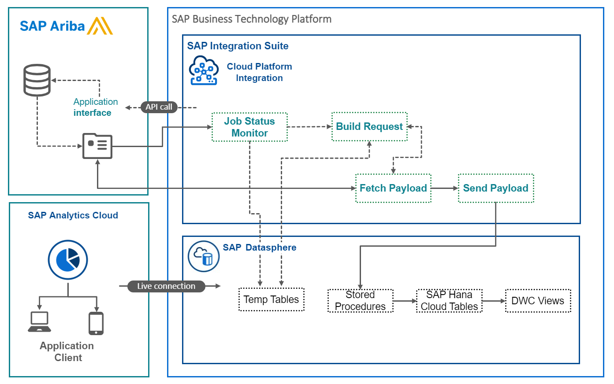

## Services and Components

The components in this end to end Integration are the following:

|Service | Description|
---------|---------
|[SAP Integration Suite](https://discovery-center.cloud.sap/serviceCatalog/integration-suite/?region=all&tab=service_plan) | Develop and manage enterprise-wide integration across heterogeneous landscapes|
|[SAP Datasphere](https://discovery-center.cloud.sap/#/serviceCatalog/sap-data-warehouse-cloud/?service_plan=standard&region=all&tab=service_plan) | Combine data management and advanced analytics|
|[SAP Analytics Cloud](https://discovery-center.cloud.sap/#/serviceCatalog/sap-analytics-cloud/?region=all&tab=service_plan) | 	One simple cloud solution for all your analytics needs|

 

### Overview

This section helps you to get a first understanding of the components that interact during the operation of the integration scenario.
-	SAP Ariba contains the source data.
-	SAP Integration Suite orchestrates the data transfer.
-	SAP Datasphere is the target destination for the data.
- SAP Analytics Cloud provides the visualization and analytical layer on top of the other components.

The asynchronous Ariba Analytical API can deliver large volumes of data for the requesting application.  The application first submits a job to the Ariba analytical API.  The job provides the information on which table and filter conditions to fulfill.  After this, SAP Ariba constructs a result set, packages up the response as archive (.zip) files, and provides the requesting application with the addresses of the archive files.  Each zip file can contain up to 50,000 data rows.  If the overall response is larger than 500,000 rows (10 zips), a second page of up to 10 zips is created.  Furthermore, the address of that page and the names of the .zip files are provided.

The Integration Scenario for Spend Analytics performs the following steps:

- Submits a Job to Ariba requesting the 8 Dimension tables and 2 Fact tables required for the Datasphere/SAP Analytics Cloud Business Content.
- Polls Ariba to determine when the Ariba response has finished and is ready to return the Pages and Zips for the response
- Builds the API requests for all of the Zips in the Ariba response and follows any URL Redirects to get to the files
- Pulls the Files to Cloud Integration Suite, Unzips the files, Builds an XML blob per zip and pushes the XML to temporary space in Datasphere
- Pushes the response data to Datasphere as XML, kicks off Datasphere stored procedures which unpack the XML to the appropriate Table and Columns in the HANA Cloud layer of Datasphere
- The Datasphere views and SAP Analytics Cloud dashboards then make use of the Ariba data to provide rich analytical capabilities for the Spend data.

For detailed documentation about the asynchronous Ariba Analytical API please review the documentation [here:](https://help.sap.com/docs/ARIBA_APIS/bf0cde439a0142fbbaf511bfac5b594d/6bb9d440d99b45938a75e9218650e7de.html)
