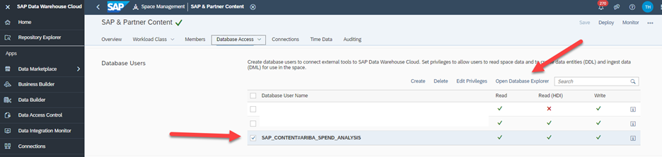

## Data Warehouse Cloud Spaces

Before you can import any SAP or partner content package, the space into which the content will imported, needs to be created.   SAP Content is currently imported into the space SAP_CONTENT.

Thus, please create a space with the technical name “SAP_CONTENT” once before you can import any content package. Please use the description “SAP Content”. In addition, you need to assign the user who will import the content to the space SAP_CONTENT

You will need the Administrator role to create a space.

- The steps to create a SPACE in Data Warehouse Cloud are [here](https://help.sap.com/docs/SAP_DATA_WAREHOUSE_CLOUD/9f804b8efa8043539289f42f372c4862/bbd41b82ad4d4d9ba91341545f0b37e7.html)

 

- Assign a user to the Space in the ‘Member Assignment’ section that will be used to test the final content package in SAP Analytics Cloud.  Instructions for this are [here](https://help.sap.com/docs/SAP_DATA_WAREHOUSE_CLOUD/be5967d099974c69b77f4549425ca4c0/9d59fe511ae644d98384897443054c16.html)

 

- Create a Database User in the Database Users section that you will use to access the HANA Cloud layer and run the SQL Table Creation scripts (needed for the Inbound Layer objects for the content).  Instructions for that are [here](https://help.sap.com/docs/SAP_DATA_WAREHOUSE_CLOUD/be5967d099974c69b77f4549425ca4c0/798e3fd6707940c3bd2219b2d1ebaac2.html)

Take note of the Database User name and Password as you will need it when you connect the Cloud Integration Suite Integration Flow to Data Warehouse Cloud.  Test that you can open the Database Explorer with this user once created

 

