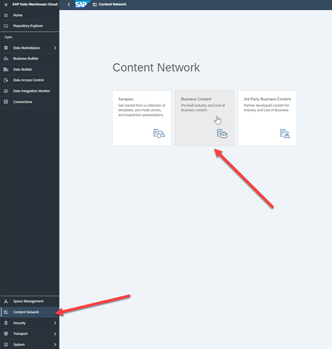
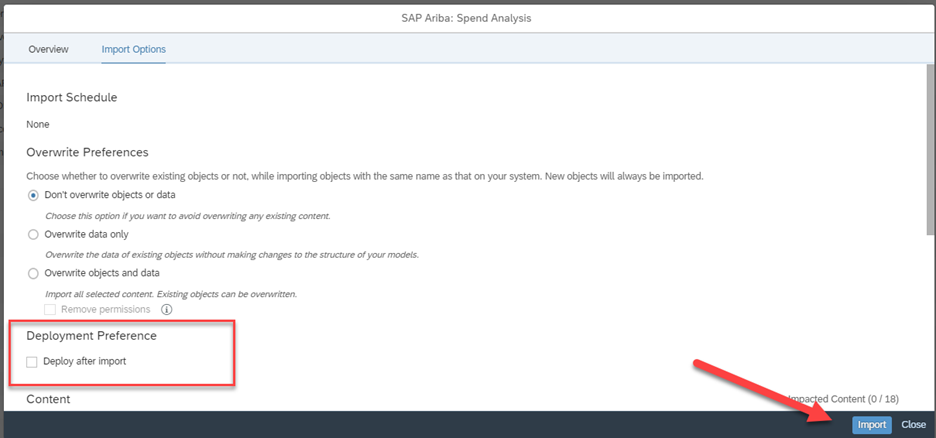

## Data Warehouse Cloud Business Content

Navigate to the Content Network area of Data Warehouse Cloud and click on Business Content.

This will bring up a listing of all available Business Content, select the item “SAP Ariba: Spend Analysis”.  This will bring up the Overview screen for this package. 

If this is the first time that you are downloading/deploying the Spend Analysis package, you won’t need to change any of the default settings under ‘Import Options’.   We will deploy all the views manually, so check that ‘Deploy after Import’ is not selected and click “Import”

Data Warehouse Cloud will download the content in the background, when it is finished there you can check the import summary screen to confirm the content was downloaded.
