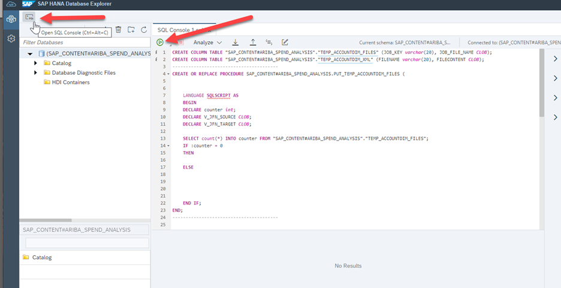

## SAP Data Warehouse Cloud Create Table Scripts

As a next step, the following tasks are to be performed:
- Building the SAP HANA Cloud base tables in in the SAP Data Warehouse Cloud system
- Building the stored procedures that handle parts of the data orchestration

Download or copy the following 10 SQL Scripts 

- [ISM_BASE_TABLE_CREATES](/src/SQL/ISM_BASE_TABLE_CREATES.sql)
- [ISM_Script_Account_Dim.sql](/src/SQL/ISM_Script_Account_Dim.sql)
- [ISM_Script_CompanySite_Dim.sql](/src/SQL/ISM_Script_CompanySite_Dim.sql)
- [ISM_Script_Contract_Dim.sql](/src/SQL/ISM_Script_Contract_Dim.sql)
- [ISM_Script_CostCenter_Dim.sql](/src/SQL/ISM_Script_CostCenter_Dim.sql)
- [ISM_Script_InvoiceLineItem_Fact.sql](/src/SQL/ISM_Script_InvoiceLineItem_Fact.sql)
- [ISM_Script_Part_Dim.sql](/src/SQL/ISM_Script_Part_Dim.sql)
- [ISM_Script_POLineItem_Fact.sql](/src/SQL/ISM_Script_POLineItem_Fact.sql)
- [ISM_Script_SourceSystem_Dim.sql](/src/SQL/ISM_Script_SourceSystem_Dim.sql)
- [ISM_Script_Supplier_Dim.sql](/src/SQL/ISM_Script_Supplier_Dim.sql)
- [ISM_Script_UNSPCS_Dim.sql](/src/SQL/ISM_Script_UNSPCS_Dim.sql)

The ISM_BASE_TABLE_CREATES script creates the 10 final destination tables in the SAP HANA Cloud system that is the target system for the SAP Ariba data.  The script creates 8 Dimension and 2 Fact tables.
The other 10 scripts will create the temporary tables and stored procedures for each dimension and fact table.  The tables are used by the SAP Integration Suite integration flow during the data transfer.   

Perform the following steps for each SQL Script:

1. Navigate to the **SAP_Content** Space in your SAP Data Warehouse Cloud system
2. Navigate to **Space Management** -> **Database Users** section.  Select the previously created database user and launch **Open Database Explorer**.  A new tab with the SAP HANA Database Explorer for SAP HANA Cockpit is opened.
3. Open a new SQL Console.
4. Paste the SQL Script from the one of the downloaded files
5. Click **RUN** (green circled arrow in the console)

To create all base tables, repeat these steps for each downloaded SQL script file.
