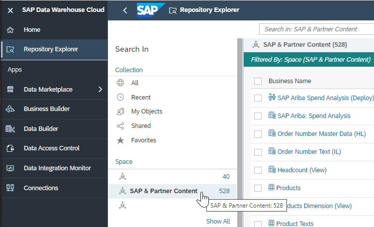

## Deploying SAP Data Warehouse Cloud Business Content

With the previous steps, you successfully created the SAP HANA Cloud tables (input layer). Now, you can deploy the SAP Data Warehouse Cloud views (harmonization layer and reporting layer).

Navigate to the Repository Explorer and Select the SAP & Partner Content Space

 

If you’ve downloaded other business content packages into this space, you can reduce the list of views to be deployed by selecting the ‘Not Deployed’ filter in the search pane.

 

To Deploy a view, click on the view name.  The view name is displayed on the Data Builder screen for the view.  On the Data Builder screen, click on the Deploy button for the view.

 

Caution: Avoid navigating back and forth from the list of views to the data builder when deploying these views (by right clicking on the view name in the list and ‘open in new tab’).  After you deploy the view, you can close that tab.

Deploy the input layer views first, followed by harmonization layer views, and finally the reporting layer views.

Deploy the following views:

### Input Layer Views – technical names
- SAP_PROC_SA_IL_AccountDim
- SAP_PROC_SA_IL_SupplierDim
- SAP_PROC_SA_IL_PartDim
- SAP_PROC_SA_IL_CompanySiteDim
- SAP_PROC_SA_IL_UNSPSCDim
- SAP_PROC_SA_IL_ContractDim
- SAP_PROC_SA_IL_SourceSystemDim
- SAP_PROC_SA_IL_CostCenterDim
- SAP_PROC_SA_IL_POLineItemFact
- SAP_PROC_SA_IL_InvoiceLineItemFact
### Harmonization Layer Views – technical names
- SAP_PROC_SA_HL_PPA_Variance
- SAP_PROC_SA_HL_PPV_Variance
- SAP_PROC_SA_HL_SOC_Variance
- SAP_PROC_SA_HL_SupplierDim
### Reporting Layer Views – technical names
- SAP_PROC_SA_RL_PART_OPTIMIZATI
- SAP_PROC_SA_RL_SPEND_ANALYSIS
### Entity Relationship diagram – technical name
- SAP_PROC_SA_ER_DEPLOY
 
