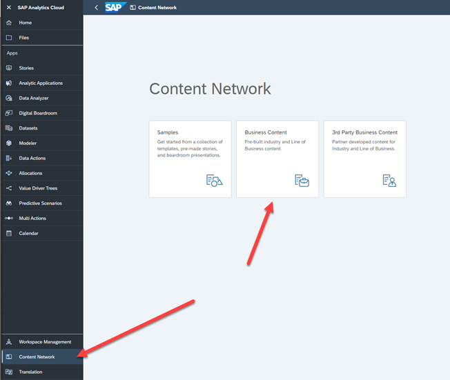

## Connect your SAP Analytics Cloud service to SAP Data Warehouse Cloud

To connect the SAP Analytics Cloud Spend Analysis visualization layer to the SAP Data Warehouse Cloud views, ensure that the SAP Analytics Cloud service and the SAP Data Warehouse Cloud service are connected and a live data connection is established.

To establish a connection between the two services, you need an administrator for the SAP Analytics Cloud tenant.

Follow the steps described at [Live Data Connections to SAP Data Warehouse Cloud](https://help.sap.com/docs/SAP_ANALYTICS_CLOUD/00f68c2e08b941f081002fd3691d86a7/ad4281e2875949f0b4d45d1072ff4c38.html) to establish trust between SAP Analytics Cloud and Data Warehouse Cloud.

In particular, make sure that you perform the following tasks:
- Establish a live connection to SAP Data Warehouse Cloud.
- Name the connection “SAP Data Warehouse Cloud”. 
- Verify that the views are displayed in SAP Data Warehouse Cloud from SAP Analytics Cloud.

Note: This naming convention for the connection is required for SAP Analytics Cloud business content.

## Download and Deploy the SAP Analytics Cloud Business Content

SAP Analytics Cloud is used as the visualization layer for SAP Ariba Spend Analytics.  It comes with several prebuilt dashboards that provide you insights into your spend data.  Using SAP Analytics Cloud, navigate to the Content Network section and click the Business Content tile.

From the list of downloadable business content, click on the SAP Ariba: Spend Analysis entry.  This step opens a screen that provides more information on the the content.  There is no need to change the any import option.  Click Import to kick off the download.

After you've been notified that the download is complete, navigate to Files -> My Files -> Public -> SAP_Content -> SAP_PROC_Spend_Analysis.  This step allows you to access all three dashboards from this package.  Consider that until we configure and run the integration flows, there's no data to populate these analytic dashboards. 

For more details about the SAP Analytics Cloud portion of the Spend Analysis business content, check out [Architecture and Abstract](https://help.sap.com/docs/SAP_ANALYTICS_CLOUD/42093f14b43c485fbe3adbbe81eff6c8/7815a7238338495eb47651b0c6aa3c4e.html)
