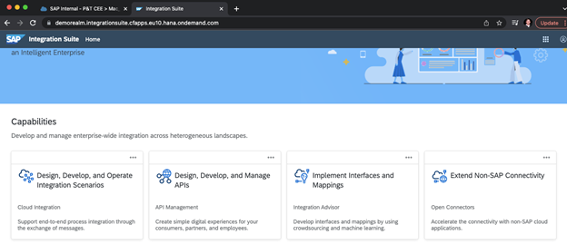
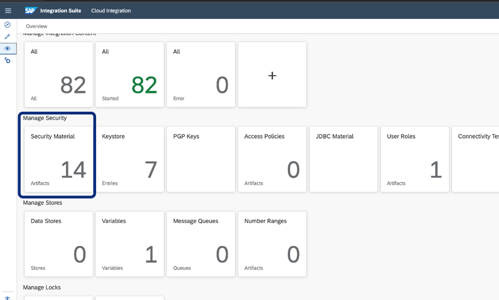
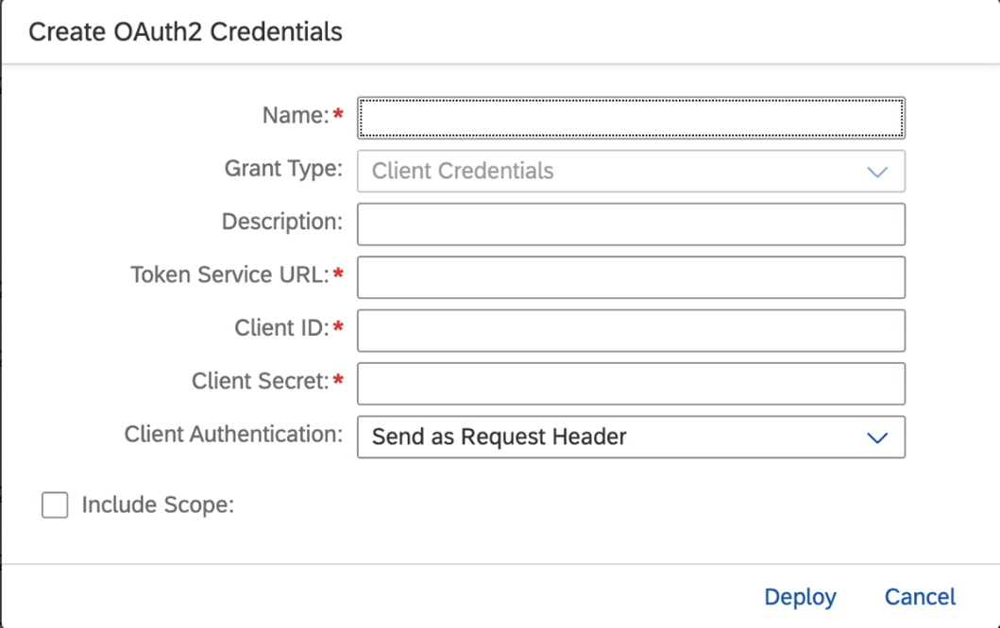

## Connect Cloud Integration Suite to Ariba

Security Materials are endpoints we need to create to allow flow of data from the source system. You will need to create a User Credentials (the access token) and then an OAuth2 Client Credentials to call the data.

Log in to your Business Technology Platform Cockpit and access the Integration Suite.  Design, Develop, and Operate Integration Scenarios:

 

 
On the top left menu bar click on the ‘Eye‘ icon (Monitor), then click on the Security Material tile in the Manage Security section.

 

Use the Create dropdown menu in the top right corner of the Manage Security Material screen, and select OAuth2 Client Credentials. 

 

Fill in the fields for the OAuth 2 dialog with Client Credentials information.  Press Deploy and exit the Security Material area.
