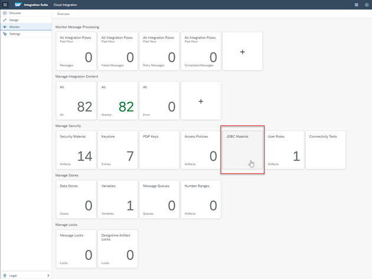
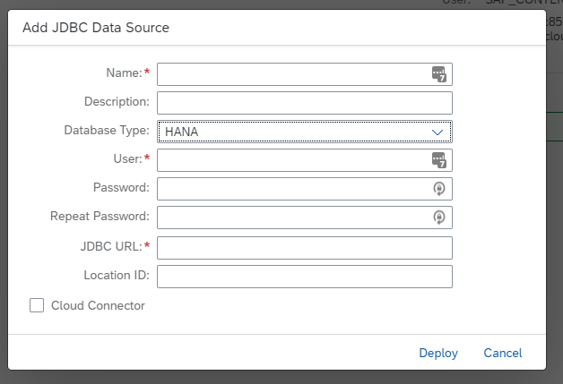
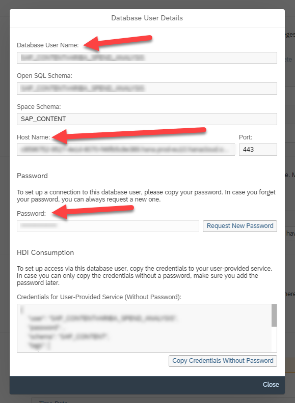

## Connect SAP Integration Suite to SAP Data Warehouse Cloud

Create a JDBC connection to SAP Data Warehouse Cloud.  JDBC is the protocol over which the XML blobs are moved to SAP Data Warehouse Cloud. 

Log in to your SAP BTP cockpit and access SAP Integration Suite.  

On the SAP Integration Suite homepage, select **Design, Develop, and Operate Integration Scenarios**.  As in the previous step click on the **Eye** icon (Monitor), then click on the **JDBC Material tile** in the Manage Security section.

Create a new JDBC connection by clicking the Add button.

Name the JDBC connection ‘Data Warehouse Cloud_HANACLOUD’, and fill in the JDBC URL, the User and the Password fields. Please take note that the host name needs a jdbc:sap:// prefix, and a :443 suffix. You can get this information from SAP Data Warehouse Cloud.  You find this information in Database User Details information box.  You can access this box by clicking the info icon to the right of the DB User in the Data Warehouse Cloud Space.

 

Click Deploy. 
