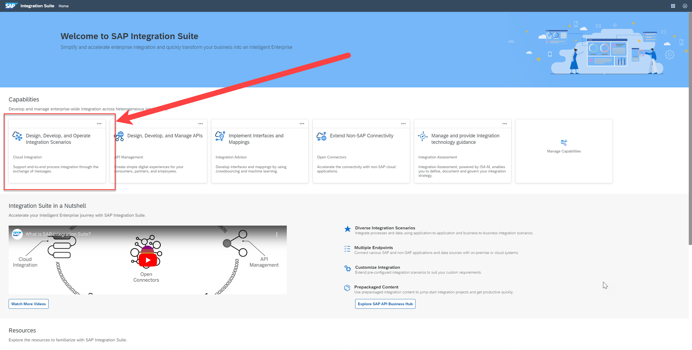
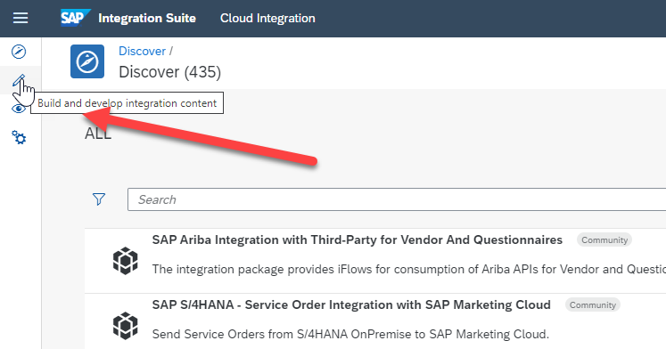
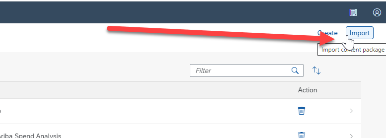
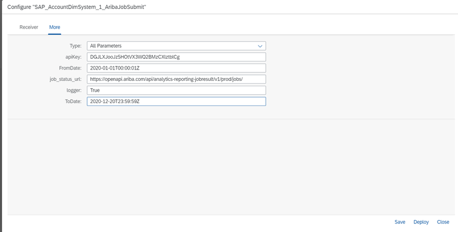

## Deploy Integration Flows

Click [this link](https://github.com/SAP-samples/btp-spend-analysis/tree/main/src/Flows) to download the integration flow package to the downloads folder on your computer.  You need this file in the following steps below, therefore make note of where you download it.

This integration package contains 62 Integration Flows:

- 10 sets of 6 integration flows - 1 set for each table we connect to
- 2 manager integration flows - 1 for facts / 1 for dimensions

You use the manager integration flows as a centralized objects to configure date/time parameters for all integration flows at one time.

 

1. From the SAP Integration Suite homepage, click the 'Design, Develop and Operate Integration Scenarios':

2. Select the 'Build and Develop Integration Content' icon from the left menu bar  

3. In the top right of the screen, select Import  

4. Go to the Configure option of each integration flow with a name containing ”_1_” and change the configuration parameters like dates, APIKEY, and so forth (as shown in the screenshot below)
 

 
5 To trigger the **Dimension Tables** interface, deploy integration flow -> **SAP_1_Ariba_Dimension_Tables**
6 To trigger **Fact Tables** interface, deploy integration flow -> **SAP_2_Ariba_Fact_Tables**
 

Important Note – There's a known Cloud Integration limitation.  If the dataset from SAP Ariba contains more than a million records, Cloud Integration runs into “Disk Space” Errors.  Therefore, apply the following workaround: Fetch and process limited amounts of data from SAP Ariba. For example, configure the “From and To” date range in such a way that SAP Ariba data is fetched within a time range of 3 months.  Put another way, if you have to run for the scenario for a duration of 1 year, break the process into chunks of 4 quarters by configuring the date range selection accordingly.
